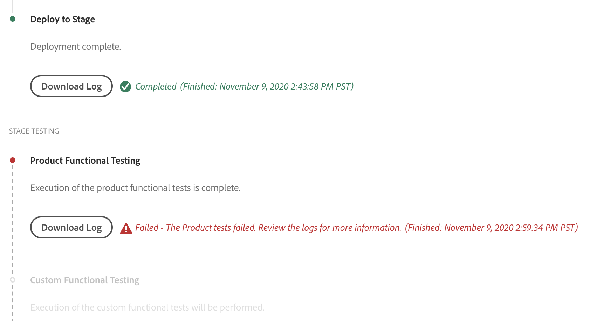

# "Product Functional Tests" (productTest) step fail
If the AEM as a Cloud deploy fails at "Product Functional Testing" step then follow the steps [here](https://github.com/adobe/aem-test-samples/blob/aem-cloud/README.md#run-the-test-against-your-aem-cloud-service-author-and-publish-tiers) to run the tests locally.

Some tips for proper local testing:
1. Download the [latest AEM SDK](https://experienceleague.adobe.com/docs/experience-manager-cloud-service/implementing/developing/aem-as-a-cloud-service-sdk.html?lang=en#developing)
2. Make sure to setup and use the [Dispatcher docker container](https://experienceleague.adobe.com/docs/experience-manager-learn/cloud-service/local-development-environment-set-up/dispatcher-tools.html?lang=en#local-development-environment-set-up) included with the SDK zip.
3. Install your dispatcher configurations to the local instance.
4. To simulate a realistic AEM Cloud environment, make sure you edit your OS ```hosts``` file with 127.0.0.1 entries so you can match the correct Apache ```VirtualHost```.

### Screenshot of "Product Functional Testing" failure

